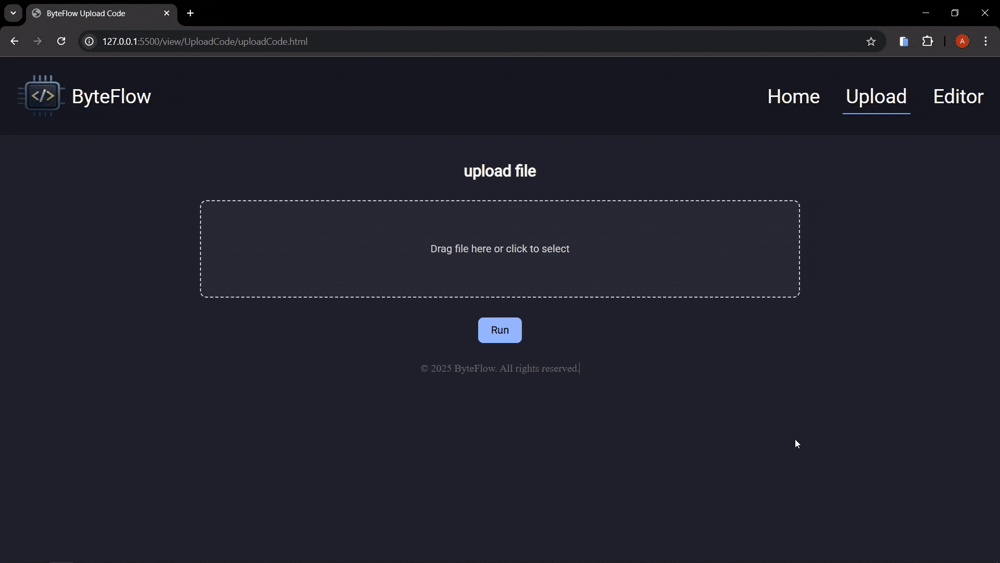

<h1 align="center">
🚀 ByteFlow - Simulador Assembly MIPS
</h1>

<p align="center">
Uma aplicação web para simular e interpretar Assembly MIPS com foco educacional.
</p>

<hr>

## 📚 Sumário

- [🧾 Introdução](#-introdução)  
- [📌 Resumo](#-resumo)  
- [🛠️ Desenvolvimento](#️-desenvolvimento) 
- [✅ Conclusão](#-conclusão) 
- [📄 Páginas da Aplicação e Suas Funcionalidades](#-páginas-da-aplicação-e-suas-funcionalidades)  
  - [1. Página Inicial](#1-página-inicial)  
  - [2. Página de Upload](#2-página-de-upload)  
  - [3. Página do Editor](#3-página-do-editor)
  - [4. Página CodeRun](#4-página-coderun) 
- [✨ Funcionalidades Principais](#-funcionalidades-principais)  
- [🔧 Tecnologias Utilizadas](#️-tecnologias-utilizadas)
- [🎨 Paleta de Cores](#-paleta-de-cores)
- [📂 Estrutura do Projeto](#-estrutura-do-projeto)   
- [🚀 Como Executar](#-como-executar)  
- [👨‍💻 Autores](#-autores)  

## 🧾 Introdução

O ByteFlow é uma ferramenta web desenvolvida para simular a execução de programas na arquitetura MIPS. Ele permite aos usuários executarem código Assembly passo a passo, acompanhando visualmente o estado dos registradores e da memória a cada ciclo de clock. O sistema oferece recursos como:
- Leitura de instruções;
- Visualização do registrador PC;
- Exibição da instrução atual em hexadecimal;
- Cálculo do tempo total de execução.

Essa abordagem proporciona um ambiente didático e interativo voltado ao aprendizado do funcionamento interno de processadores MIPS. Com sua interface amigável, o ByteFlow atua como um recurso para estudantes da área de arquitetura de computadores.

## 📌 Resumo

O ByteFlow é um protótipo de aplicação web desenvolvido com o objetivo de interpretar visualmente código Assembly. Desenvolvido inteiramente com tecnologias de front-end como HTML, CSS e JavaScript, o projeto oferece uma interface gráfica onde o usuário pode digitar, salvar código, visualizar ou enviar código Assembly para ser manipulado.

Ainda que não conte com um mecanismo de interpretação real das instruções Assembly, o ByteFlow representa um passo inicial importante para o desenvolvimento de uma plataforma completa. Sua estrutura modular inclui componentes como um editor de código, uma tela de upload de arquivos e uma página inicial com layout responsivo.

O objetivo central do projeto é facilitar o aprendizado e a análise do Assembly por meio de uma ferramenta acessível, especialmente voltada para estudantes da computação de baixo nível.

## 🛠️ Desenvolvimento

O desenvolvimento e estrutura da aplicação está contida na pasta view/, subdividida em três módulos principais:

- **`Inicial/`**: Contém a página de entrada do sistema com layout estruturado por meio de HTML e CSS, além de um script em JavaScript para geração dinâmica de conteúdo.

- **`CodeEditor/`**: Inclui um editor de código com suporte para digitação de Assembly. Aqui é onde ocorre a maior parte da interação do usuário com o conteúdo.

- **`UploadCode/`**: Responsável por fornecer uma interface para envio de arquivos contendo instruções Assembly.

Além disso, o projeto traz um logotipo personalizado, estilizações responsivas e modularização clara dos arquivos. O código-fonte segue padrões de organização e é de fácil leitura, o que facilita a manutenção e contribuições de outros desenvolvedores.

## ✅ Conclusão

O ByteFlow é uma aplicação voltada ao ensino da linguagem Assembly MIPS, oferecendo uma interface clara e interativa que facilita a compreensão dos principais conceitos da arquitetura. Por meio de funcionalidades como editor de código, upload de arquivos e visualização de registradores, a ferramenta contribui para o aprendizado prático em um ambiente acessível via navegador. Sua estrutura modular e o uso de tecnologias web permitem uma navegação fluida, tornando o ByteFlow uma ferramenta útil para estudantes explorarem os fundamentos da programação em baixo nível e da arquitetura de computadores.

---

## 📄 Páginas da Aplicação e Suas Funcionalidades

### 1. Página Inicial

- Apresentação do projeto
- Navegação para Upload e Editor
- Informações principais sobre o ByteFlow


### 2. Página de Upload

- Suporte a Drag & Drop
- Preview do arquivo
- Leitura de arquivos **`.asm`**/**`.txt`**


### 3. Página do Editor

- Editor CodeMirror com tema Dracula
- Botões:
  - Save → Baixa o arquivo **`.asm`**
  - Run → Executa o codigo


### 4. Página CodeRun

- Interface de simulação da execução Assembly
- Exibição das instruções linha por linha com:
  - **PC (Program Counter)**
  - **Tipo e codificação** da instrução
  - **Thread traduzida** em Assembly
- Visualização dinâmica dos **registradores**
- Bloco de memória principal com endereçamento hexadecimal
- Controles para **execução passo a passo** e **execução contínua**
- Detalhes adicionais como:
  - Instrução atual
  - Tipo da instrução
  - Tempo de execução por linha


## ✨ Funcionalidades Principais

<ul>
  <li>🎯 Editor de Código Assembly Interativo</li>
  <li>📂 Upload de Arquivos <code>.asm</code> ou <code>.txt</code></li>
  <li>⚙️ Simulação da execução MIPS com recursos planejados:
    <ul>
      <li>Leitura e execução de instruções</li>
      <li>Visualização do estado da memória e registradores</li>
      <li>Monitoramento do PC (Program Counter)</li>
      <li>Representação hexadecimal da instrução</li>
      <li>Cálculo de tempo de execução</li>
    </ul>
  </li>
  <li>💾 Salvar / Editar Código</li>
  <li>🧭 Interface amigável com navegação clara</li>
</ul>

## 🛠️ Tecnologias Utilizadas

<ul>
  <li><span style="color:#92b5ff">HTML5</span></li>
  <li><span style="color:#92b5ff">CSS3</span></li>
  <li><span style="color:#92b5ff">JavaScript ES6+</span></li>
  <li><span style="color:#92b5ff">TypeScript</span></li>
  <li><span style="color:#92b5ff">CodeMirror</span></li>
</ul>

## 🎨 Paleta de Cores


```css
--header-bg:      #161720;        /* Fundo do Cabeçalho */
--page-bg:        rgb(32, 34, 44);/* Fundo da Página */
--text-light:     #f8f8f2;        /* Texto Claro */
--highlight-pink: #92b5ff;        /* Destaques */
```

## 📂 Estrutura do Projeto

```bash
ByteFlow_asm_reader/
├── Asm_Instructions/
│   ├── Instructions/
│   ├── Runtime/
│   └── index.ts
├── assets/
├── js/
│   ├── Instructions/
│   │   ├── Arithmetics/
│   │   ├── Conditional_Deviation/
│   │   ├── Data_Transfer/
│   │   ├── Logic/
│   │   ├── Unconditional_Deviation/
│   │   ├── lInstructions.js
│   │   └── Literal_Control.js
│   ├── Runtime/
│   └── index.js
├── node_modules/
├── view/
│   ├── CodeEditor/
│   │   ├── codeEditor.css
│   │   ├── codeEditor.html
│   │   └── codeEditor.js
│   ├── CodeRun/
│   │   ├── codeRun.css
│   │   ├── codeRun.html
│   │   └── codeRun.js
│   ├── Inicial/
│   │   ├── index.html
│   │   ├── layout.js
│   │   └── style.css
│   └── UploadCode/
│       ├── uploadCode.css
│       ├── uploadCode.html
│       └── uploadCode.js
├── .gitignore
├── package-lock.json
├── package.json
├── README.md
└── tsconfig.json
```

## 🚀 Como Executar

Você pode executar o projeto de duas formas:

### Opção 1: Baixar os arquivos manualmente
1. Baixe o *`.zip`* do repositório.
1. Busque a pasta do projeto dentro da pasta **`htdocs`** do XAMPP (geralmente em **`C:\xampp\htdocs\`** no Windows) ou abra um servidor em sua maquina local.
3. Descarregue o arquivo compactado na pasta escolhida.
4. Abra o painel do XAMPP.
5. Inicie o servidor Apache no XAMPP.
6. No navegador, acesse a aplicação pelo endereço:  
   **`http://localhost:porta/view/Inicial/index.html`**  
   Ajuste a **porta** conforme a configuração do seu Apache (exemplo: 80, 81...).


### Opção 2: Clonar via Git

1. Abra o terminal ou prompt de comando.
2. Clone o repositório para sua pasta de desejo com o comando:  
    ```bash
        cd caminho/da/sua/pasta
        git init #caso já não tenha sido iniciado
        git clone 
    ```
3. Faça o processo da **Opção 1** do passo 4 ao 6.

## 👨‍💻 Autores

- <a href="https://github.com/YanSilva22"> Yan Silva </a>  
- <a href="https://github.com/AlexandreComp456890"> Alexandre Rocha </a>  
- <a href="https://github.com/jhenifersgomes209"> Jhenifer Gomes </a>
